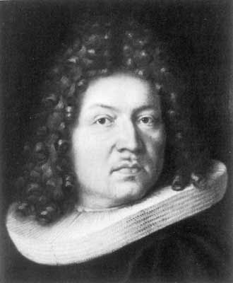
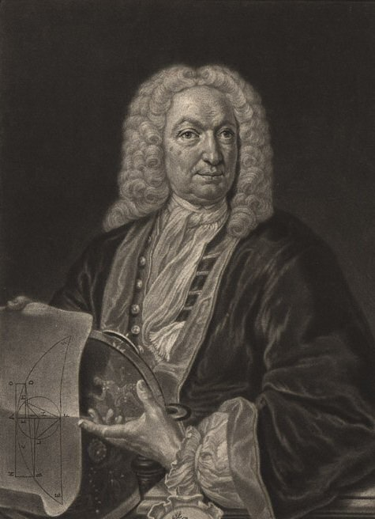
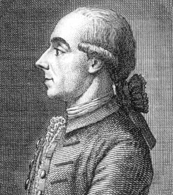

+++
title = "Bernoulli: Um nome, muitos matemáticos"
date = 2025-06-10T08:00:00-03:00
draft = false

tags = ["petiscos"]
eventos = []
+++

Dentre todas as etapas que a história da Matemática presenciou, uma das que mais se destaca está na família Bernoulli. A princípio, quando estamos estudando Física no Ensino Médio, nos deparamos com o chamado Princípio de Bernoulli para fluidos. Avançando um pouco mais e migrando para a Matemática, temos a chamada Desigualdade de Bernoulli. Na teoria das equações diferenciais, encontramos a Equação de Bernoulli, que se trata de uma equação diferencial ordinária não linear de primeira ordem.

Estes foram apenas alguns exemplos em que esse nome aparece em contextos da Matemática e da Física, mas a pergunta que fica é a seguinte: são a mesma pessoa?
A resposta é: não! A família Bernoulli constitui um caso intrigante e raramente visto na história das ciências, no qual oito matemáticos dessa mesma família, no intervalo de um século, fizeram grandes contribuições à história da Matemática.

Oriunda da Suíça, reza a história que o pai daqueles que viriam a constituir a célebre família de eminentes matemáticos residia originalmente em Antuérpia, na Bélgica. O progenitor da família teria sido forçado a abandonar o país por ser protestante. Estabelecido em Basileia, contraiu matrimônio com uma senhora de uma das grandes famílias de banqueiros e conselheiros da cidade, tendo-se tornado mercador de sucesso e oficial da cidade.
Diante da vocação do pai para a área comercial, o mais comum seria esperar que os filhos herdassem sua carreira. No entanto, não foi o que ocorreu, pois os filhos não revelavam vocação para o ofício. Quando foram admitidos na universidade, passaram a frequentar cursos como Magistratura ou Medicina. Só mais tarde, com a manifestação de grande interesse pela Matemática, acabaram por se dedicar a essa grande área.

Abaixo está uma pequena biografia de alguns dos principais membros da família Bernoulli:

## Jacob I (1654 - 1705)

<figure class="mx-auto max-w-fit"> 
    
    <figcaption class="mx-auto max-w-fit">Jacob I (1654 - 1705)</figcaption>
</figure>

Foi compelido a estudar Filosofia e Teologia por seus pais, tendo-se graduado na Universidade de Basileia como mestre em Filosofia em 1671 e licenciado em Teologia em 1676. Contra a vontade dos pais, estudou Matemática e Astronomia, tendo ministrado a cadeira de Matemática em Basileia até a data de sua morte. Juntamente com seu irmão Johann I, estudou e difundiu na Europa o cálculo de Leibniz. Apesar de nunca ter feito nenhuma publicação formal, deixou vários artigos em jornais científicos da época, um importante diário — Meditationes — e uma obra inacabada: Ars Conjectandi.

## Johann I (1667 - 1748)

<figure class="mx-auto max-w-fit"> 
    
    <figcaption class="mx-auto max-w-fit">Johann I (1667 - 1748)</figcaption>
</figure>

Tal como seu irmão Jacob, apesar de ter estudado Medicina, seu interesse pela Matemática falou mais alto, tendo sido iniciado na área pelo próprio irmão. Apesar dessa relação inicial, a vida dos dois foi marcada por intermináveis quezílias e disputas científicas. Também com seu filho Daniel não conseguiu evitar conflitos, havendo relatos de que chegou a expulsá-lo de casa após uma disputa acadêmica. Conta-se ainda que obrigou o filho a partilhar com ele a glória de uma das suas descobertas.
Johann I Bernoulli foi um dos mais bem-sucedidos matemáticos de sua época, sendo frequentemente apelidado de “Aristóteles do Século XVII”. Com a morte de Jacob, assumiu a cadeira de Matemática na Universidade de Basileia, onde permaneceu até sua morte. Anteriormente, havia sido professor de Física e Matemática em Groningen. Suas áreas de maior interesse foram o estudo das propriedades da luz, as famílias de curvas (como o problema da braquistócrona), a quadratura de áreas e as séries.

## Johann III (1744 - 1807)

<figure class="mx-auto max-w-fit"> 
    
    <figcaption class="mx-auto max-w-fit">Johann III (1744 - 1807)</figcaption>
</figure>

Considerado um prodígio desde pequeno, obteve o grau de doutor em Direito aos 14 anos. Como todos os Bernoulli, interessou-se por Matemática e foi chamado pela Academia de Berlim aos 19 anos. O rei Frederico II nomeou-o para dirigir o observatório astronômico da Academia, tarefa para a qual não estava adequadamente preparado. Assim, a maior parte de suas obras recaiu sobre Astronomia, mas sem grande fama ou glória.
Suas áreas de maior interesse foram Probabilidades, Recorrência Decimal e Equações Diferenciais.

É notável o quão raro é para um legado tão grande ser deixado assim e, para não perder o costume deixo-lhes agora com o seguinte questionamento já tocado em um dos textos anteriores: quanto tempo será necessário até que um fenômeno como esse aconteça novamente? o quanto podemos avançar se ocorrer?
